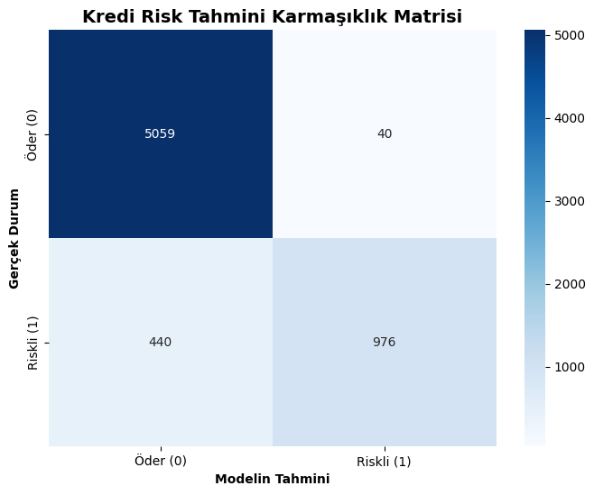

# 🏦 Retail Credit Risk Estimation with Artificial Neural Networks (ANN)

🚀 **Live Demo (Web App):** [Try the Credit Risk Estimation System](https://enes-kredi-risk.streamlit.app/)
🇹🇷 **[Türkçe versiyon için tıklayın (Turkish Version)](README_tr.md)**

This project is an end-to-end **Machine Learning and Deep Learning** pipeline developed to predict retail credit default risk, a common problem in the banking sector. The model not only performs classification but also covers data preprocessing, statistical cleaning, financial risk analysis, and features an **interactive web interface**.

## ⚙️ Technologies and Architecture
* **Language:** Python
* **Web Interface & Deployment:** Streamlit
* **Data Engineering:** Pandas, NumPy
* **Machine Learning & Scaling:** Scikit-Learn
* **Deep Learning Architecture:** TensorFlow / Keras (Multi-Layer Perceptron)
* **Data Visualization:** Matplotlib, Seaborn

## 🛠️ Data Engineering (Preprocessing) Steps
To handle the impurities and missing values in real-world data, the following steps were applied with a database mindset before feeding the data to the model:
1. **Missing Data Management:** Null values in `person_emp_length` and `loan_int_rate` were filled with the **median** to avoid the influence of outliers.
2. **Outlier Cleaning:** Rows containing data entry errors (e.g., age 144, employment length 123 years) were filtered using logical operators.
3. **Categorical Transformation (One-Hot Encoding):** Text-based features were converted into matrix format. The `drop_first=True` parameter was applied to prevent Multicollinearity and the Dummy Variable Trap.
4. **Scaling:** To prevent weights from being dominated during optimization, all features were normalized using `StandardScaler` (mean=0, standard deviation=1).

## 🧠 Model Architecture
A **Multi-Layer Perceptron (MLP)** was used for this project.
* **Input Layer:** 22 features.
* **Hidden Layers:** Two layers with 64 and 32 neurons. The **ReLU** activation function was used to prevent the vanishing gradient problem.
* **Regularization:** **Dropout** layers (20%) were added to prevent the network from overfitting.
* **Output Layer:** A single neuron with a **Sigmoid** activation function to calculate the risk probability. Optimized using `adam` and `binary_crossentropy` as the loss function.

## 📊 Results and Performance Analysis
The model was trained for 50 epochs and evaluated on a 20% unseen test dataset.

* **Overall Accuracy:** 93%
* **Precision (Detecting Risky Customers):** 96%

> **Financial Risk Interpretation:** Analyzing the Confusion Matrix, 96% of the customers the model flagged as "Risky" were actual defaults. However, our sensitivity (Recall) in catching all risky customers in the world remained at 69%. From a banking perspective, the fundamental mathematical reason for missing these 440 customers (False Negatives) is the **Imbalanced Data** in our dataset.



## 🚀 Future Work
In the next phase, the **SMOTE** (Synthetic Minority Over-sampling Technique) algorithm will be integrated to increase the low Recall value and strengthen the model's sensitivity on the minority class (risky customers).

## 💻 How to Run Locally

To run this project on your local machine:

1. Clone the repository:
   ```bash
   git clone [https://github.com/enesornk/Credit-Risk-Estimation.git](https://github.com/enesornk/Credit-Risk-Estimation.git)
2. Install the required libraries:
    ```bash
    pip install -r requirements.txt
3. To Start the Web Interface:
    ```bash
   streamlit run app.py
4. To Inspect the Model Training Process:
    Open the kredi_modeli.ipynb file via Jupyter Notebook and run the cells sequentially.  